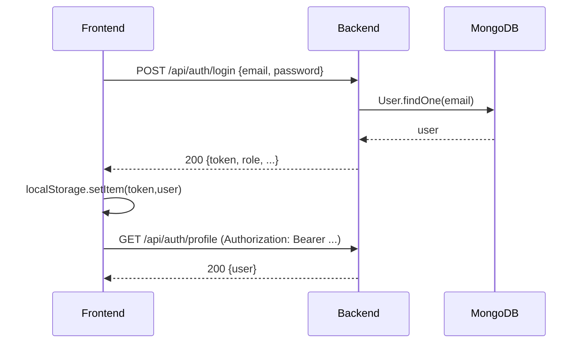
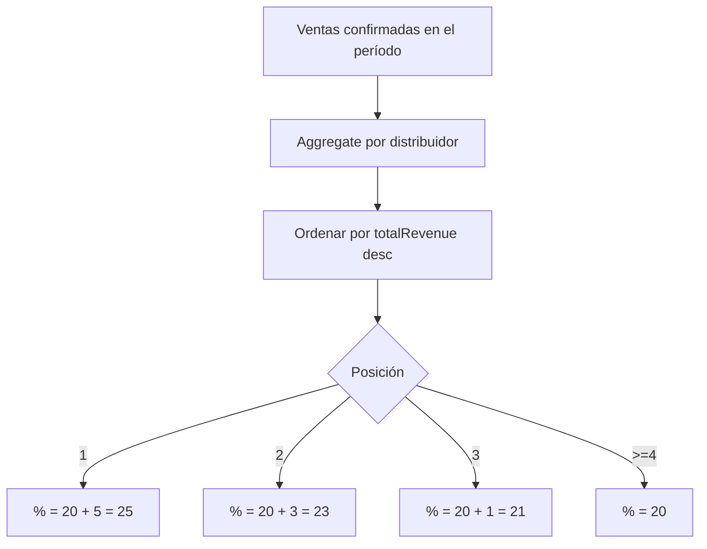
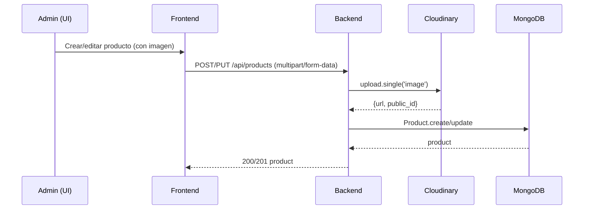
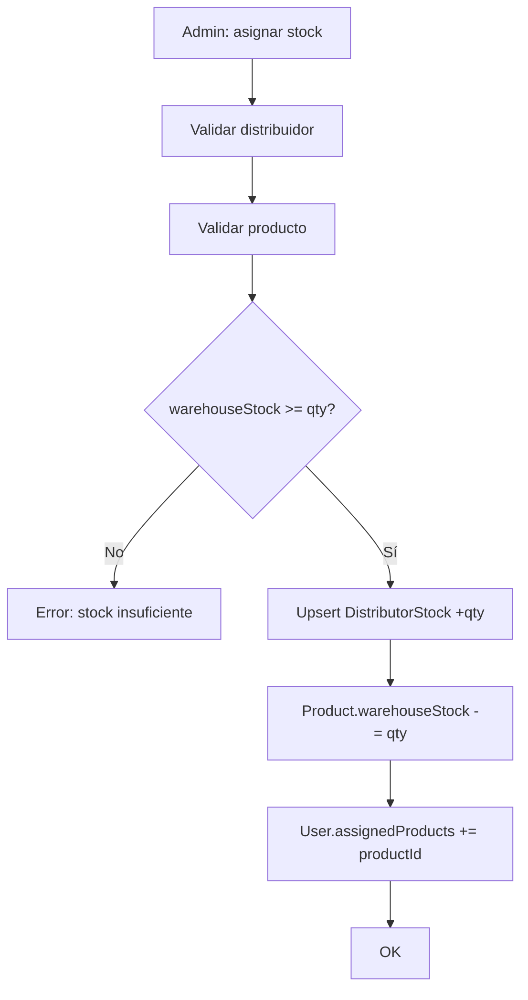
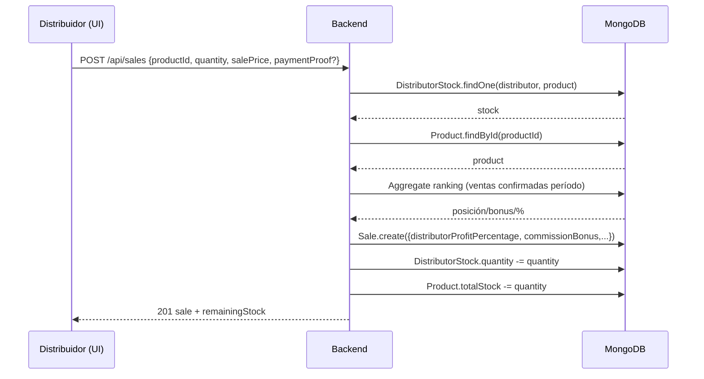

# Flujo de trabajo (diagrama de flujo) — Essence

Este documento describe el flujo real de la app (frontend React/Vite + backend Express + MongoDB), separado por rol (Admin vs Distribuidor) e incluyendo valores/cálculos clave (comisiones 25/23/21/20, ganancias, estados).

> Nota: los endpoints listados están montados bajo `/api` en el backend.

---

## Diagrama de flujo (principal)

```mermaid
flowchart TB
  S([Inicio]) --> O[Usuario abre la app]
  O --> R{¿Hay token + user
en localStorage?}
  R -- No --> L[Login]
  L --> AL[POST /api/auth/login]
  AL --> LS[Guardar token + user]
  LS --> R
  R -- Sí --> ROLE{Rol del usuario}

  ROLE -- admin --> A0[Admin: /admin/dashboard]
  ROLE -- distribuidor --> D0[Distribuidor: /distributor/dashboard]

  %% --- ADMIN ---
  subgraph ADMIN[Flujos Admin]
  direction TB
  A0 --> A1[Gestionar productos
GET/POST/PUT/DELETE /api/products]
  A0 --> A2[Gestionar categorías
CRUD /api/categories]
  A0 --> A3[Gestionar distribuidores
CRUD /api/distributors]

  A0 --> A4[Inventario (bodega → distribuidor)]
  A4 --> A41[Asignar stock
POST /api/stock/assign]
  A4 --> A42[Retirar stock
POST /api/stock/withdraw]
  A4 --> A43[Ver alertas
GET /api/stock/alerts]

  A0 --> A5[Ventas]
  A5 --> A51[Registrar venta admin
POST /api/sales/admin
paymentStatus=confirmado]
  A5 --> A52[Ver/filtrar ventas
GET /api/sales]
  A5 --> A53[Confirmar pago venta distribuidor
PUT /api/sales/:id/confirm-payment]
  A5 --> A54[Eliminar venta (restaura stock)
DELETE /api/sales/:id]

  A0 --> A6[Gamificación / Ranking]
  A6 --> A61[Ranking
GET /api/gamification/ranking]
  A6 --> A62[Config
GET/PUT /api/gamification/config]

  A0 --> A7[Auditoría]
  A7 --> A71[Logs
GET /api/audit/logs]
  end

  %% --- DISTRIBUIDOR ---
  subgraph DIST[Flujos Distribuidor]
  direction TB
  D0 --> D1[Ver catálogo asignado
GET /api/products/my-catalog]
  D0 --> D2[Ver stock propio
GET /api/stock/distributor/me]
  D0 --> D3[Transferir stock
POST /api/stock/transfer]

  D0 --> D4[Registrar venta
POST /api/sales]
  D4 --> D41[Validar stock del distribuidor]
  D41 -->|OK| D42[Crear venta con % comisión]
  D41 -->|Error| D4E[Error: stock insuficiente]

  D42 --> PEND[paymentStatus=pendiente
(si no es venta admin)]
  PEND --> WAIT[Esperar confirmación del admin]
  WAIT --> CONF[paymentStatus=confirmado]
  end

  %% --- COMISIÓN / VALORES ---
  subgraph COMM[Comisión y valores guardados en cada venta]
  direction TB
  CONF --> COMM1[La venta confirmada cuenta para ranking del período]
  COMM1 --> COMM2[Bonus por posición:
1º +5 → 25%
2º +3 → 23%
3º +1 → 21%
Resto +0 → 20%]
  COMM2 --> COMM3[Backend recalcula ganancias en save():
priceForDistributor = P*(1-r/100)
distributorProfit = (P-priceForDistributor)*qty
adminProfit = (priceForDistributor-C)*qty]
  end
```

## 1) Mapa del sistema (alto nivel)

```mermaid
flowchart LR
  U[Usuario] -->|Navega| FE[Frontend (Vercel)
React + Vite + TS]
  FE -->|HTTP JSON / multipart| BE[Backend (Railway)
Node + Express]
  BE -->|Mongoose| DB[(MongoDB Atlas)]
  BE -->|Upload imágenes| CL[Cloudinary]

  subgraph Auth
    FE -->|Bearer token (localStorage)| BE
  end
```

### Roles

- **Admin**: gestiona productos/categorías, distribuidores, inventario (bodega), ventas admin, confirma pagos de ventas de distribuidores, analytics, auditoría, gamificación.
- **Distribuidor**: ve su catálogo y stock asignado, registra ventas, ve sus estadísticas, transfiere stock a otros distribuidores.

---

## 2) Autenticación y sesión (JWT)

**Frontend**

- En login, el frontend guarda `token` y `user` en `localStorage`.
- En cada request, Axios agrega `Authorization: Bearer <token>`.
- Si el backend responde `401`, el frontend borra sesión y redirige a `/login`.

**Backend**

- `POST /auth/login` valida credenciales y devuelve JWT.
- `GET /auth/profile` devuelve perfil según token.



---

## 3) Entidades (modelos) y campos clave

### Sale (Venta)

Campos relevantes (simplificado):

- `distributor`: `null` (venta admin) o `ObjectId` (venta distribuidor)
- `product`, `quantity`, `salePrice`, `purchasePrice`
- `distributorProfitPercentage`: **0** (admin) o **20/21/23/25** (distribuidor)
- `commissionBonus`: **0/1/3/5** (bonus por ranking)
- `distributorProfit`, `adminProfit`, `totalProfit` (se recalculan en `pre('save')`)
- `paymentStatus`: `pendiente` | `confirmado`
- `paymentProof`: string Base64 (opcional) + `paymentProofMimeType`

### Product (Producto)

Campos típicos usados por flujos:

- `purchasePrice` (costo)
- `warehouseStock` (bodega) y `totalStock` (stock global)
- `image` (Cloudinary)

### DistributorStock (Stock por distribuidor)

- `distributor`, `product`, `quantity`, `lowStockAlert`

### GamificationConfig (Config ranking)

- `evaluationPeriod`: weekly/biweekly/monthly
- `top1CommissionBonus` = 5, `top2CommissionBonus` = 3, `top3CommissionBonus` = 1
- `minAdminProfitForRanking` (filtro para entrar al ranking)

---

## 4) Cálculos de ganancias y comisión (con valores)

### 4.1 Venta de distribuidor (la fuente de verdad es el backend)

En `Sale.pre('save')`:

- Sea $P$ = `salePrice` (precio final al cliente)
- Sea $C$ = `purchasePrice` (costo)
- Sea $r$ = `distributorProfitPercentage` (20/21/23/25)

Entonces:

- **Lo que el distribuidor “paga” al admin** (se guarda en `distributorPrice`):

  $$\text{priceForDistributor} = P \cdot \left(1 - \frac{r}{100}\right)$$

- **Ganancia del distribuidor**:

  $$\text{distributorProfit} = (P - \text{priceForDistributor}) \cdot \text{quantity}$$

- **Ganancia del admin**:

  $$\text{adminProfit} = (\text{priceForDistributor} - C) \cdot \text{quantity}$$

- **Ganancia total**:

  $$\text{totalProfit} = \text{adminProfit} + \text{distributorProfit}$$

#### Ejemplo numérico

- `salePrice` $P$ = 40,000
- `purchasePrice` $C$ = 18,000
- `quantity` = 1
- Caso 20% ($r=20$)

Cálculo:

- `priceForDistributor` = 40,000 × 0.80 = 32,000
- `distributorProfit` = 40,000 − 32,000 = 8,000
- `adminProfit` = 32,000 − 18,000 = 14,000
- `totalProfit` = 22,000

### 4.2 Venta admin

- No hay distribuidor.
- `distributorProfitPercentage = 0`
- `distributorProfit = 0`
- `adminProfit = (salePrice - purchasePrice) * quantity`

---

## 5) Ranking / gamificación (cómo impacta el %)

El backend calcula el ranking por período en `getDistributorCommissionInfo`:

- Considera ventas con:
  - `distributor != null`
  - `paymentStatus = confirmado`
  - `saleDate` dentro del período
- Agrupa por distribuidor y calcula:
  - `totalRevenue = sum(salePrice * quantity)`
  - `totalAdminProfit = sum(adminProfit)`
- (Opcional) filtra por `totalAdminProfit >= minAdminProfitForRanking`
- Ordena por `totalRevenue` descendente.

Luego asigna bonus:

- Puesto 1: `bonusCommission = top1CommissionBonus` (default 5) ⇒ % final 25
- Puesto 2: `bonusCommission = top2CommissionBonus` (default 3) ⇒ % final 23
- Puesto 3: `bonusCommission = top3CommissionBonus` (default 1) ⇒ % final 21
- Resto: bonus 0 ⇒ % final 20



---

## 6) Flujo de productos e imágenes

### Endpoints principales

- `GET /products` (público, con caché)
- `GET /products/:id` (público, con caché)
- `GET /products/my-catalog` (distribuidor, requiere token)
- `GET /products/:id/distributor-price/:distributorId` (token)
- `POST /products` (admin, multipart con `image`)
- `PUT /products/:id` (admin, multipart con `image` opcional)
- `DELETE /products/:id` (admin)



---

## 7) Inventario (bodega) y stock por distribuidor

### 7.1 Asignar stock a distribuidor (admin)

Endpoint:

- `POST /stock/assign` (admin)

Reglas principales:

- Valida que el usuario destino sea `role=distribuidor`.
- Verifica `warehouseStock >= quantity`.
- Incrementa/crea `DistributorStock`.
- Descuenta `warehouseStock`.
- Agrega el producto a `assignedProducts` del distribuidor.



### 7.2 Retirar stock a distribuidor (admin)

Endpoint:

- `POST /stock/withdraw` (admin)

- Descuenta `DistributorStock.quantity`.
- Suma a `Product.warehouseStock`.

### 7.3 Ver stock

- Admin: `GET /stock/all` y `GET /stock/alerts`
- Distribuidor: `GET /stock/distributor/me`

### 7.4 Transferir stock entre distribuidores (distribuidor)

Endpoint:

- `POST /stock/transfer`

- Origen: usuario autenticado.
- Valida `toDistributorId != fromDistributorId` y cantidad > 0.
- Descuenta stock origen y suma stock destino.
- Registra en historial (`StockTransfer`).

---

## 8) Ventas (distribuidor vs admin)

### 8.1 Registrar venta como distribuidor

Endpoint:

- `POST /sales`

Flujo:

1. Verifica que el distribuidor tenga `DistributorStock` de ese producto.
2. Verifica `DistributorStock.quantity >= quantity`.
3. Obtiene el producto y valida que tenga `purchasePrice` y `distributorPrice`.
4. Calcula la comisión del distribuidor **según ranking del período**.
5. Crea la venta (por defecto queda `paymentStatus=pendiente` si no se marca en creación).
6. Descuenta stock del distribuidor (`DistributorStock.quantity`).
7. Descuenta stock global (`Product.totalStock`).
8. Invalida caché de analytics/gamificación.



### 8.2 Registrar venta como admin

Endpoint:

- `POST /sales/admin`

Diferencias:

- `distributor = null`
- Se marca **confirmada automáticamente** (`paymentStatus=confirmado`) y setea `paymentConfirmedAt`.
- Descuenta `Product.totalStock`.

### 8.3 Confirmar pago (admin)

Endpoint:

- `PUT /sales/:id/confirm-payment`

Reglas:

- Si ya está `confirmado`, responde error.
- Si estaba `pendiente`, actualiza:
  - `paymentStatus=confirmado`
  - `paymentConfirmedAt`
  - `paymentConfirmedBy`

### 8.4 Eliminar venta (admin)

Endpoint:

- `DELETE /sales/:id`

Efectos:

- Si era de distribuidor: restaura `DistributorStock.quantity += sale.quantity`.
- Restaura `Product.totalStock += sale.quantity`.
- Invalida caché (analytics/gamificación).

---

## 9) Reportes, analytics y auditoría

### 9.1 Ventas y estadísticas (admin)

- `GET /sales` soporta filtros (fecha, distribuidor, producto, estado, paginación).
- Devuelve:
  - `sales[]` (con populate básico)
  - `stats` (aggregated totals)
  - `pagination`

### 9.2 Reportes agregados (admin)

- `GET /sales/report/by-product`
- `GET /sales/report/by-distributor`

### 9.3 Auditoría (admin)

- `GET /audit/logs`
- `GET /audit/stats`
- `GET /audit/daily-summary`
- `GET /audit/entity-history/:entityType/:entityId`

---

## 10) Mapa de páginas (frontend)

### Rutas públicas

- `/` Home
- `/productos` Catálogo
- `/producto/:id`
- `/categoria/:slug`

### Auth

- `/login`, `/login/admin`, `/login/distributor`

### Admin (requiere `role=admin`)

- `/admin/dashboard`
- `/admin/products`, `/admin/add-product`, `/admin/products/:id/edit`
- `/admin/categories`
- `/admin/distributors`, `/admin/distributors/add`, `/admin/distributors/:id`
- `/admin/stock-management`
- `/admin/sales` (incluye columna de **Comisión (%)** para ventas de distribuidor)
- `/admin/register-sale` (venta admin)
- `/admin/analytics`, `/admin/advanced-analytics`
- `/admin/audit-logs`
- `/admin/gamification-config`, `/admin/rankings`

### Distribuidor (requiere `role=distribuidor`)

- `/distributor/dashboard`
- `/distributor/products`, `/distributor/catalog`
- `/distributor/register-sale`
- `/distributor/sales`, `/distributor/stats`
- `/distributor/transfer-stock`

---

## 11) Checklist rápido de “qué pasa cuando…”

- **Un distribuidor registra una venta** → se descuenta stock del distribuidor y del stock global; la venta guarda el % vigente por ranking.
- **Admin confirma pago** → cambia `paymentStatus` a confirmado; esto habilita que la venta cuente para ranking y reportes.
- **Cambia el ranking** → no “recalcula automáticamente” ventas viejas; el % queda persistido en cada venta. Para corregir histórico, se usa un script de recálculo.
- **Se borra una venta** → se restaura stock (distribuidor + global) y se invalidan caches.

---

## 12) Referencias rápidas (código)

- Frontend API: `client/src/api/axios.ts` y `client/src/api/services.ts`
- Router frontend: `client/src/App.tsx`
- Ventas backend: `server/controllers/sale.controller.js` y `server/models/Sale.js`
- Comisión/ranking: `server/utils/distributorPricing.js` + `server/models/GamificationConfig.js`
- Stock: `server/controllers/stock.controller.js` + `server/routes/stock.routes.js`
