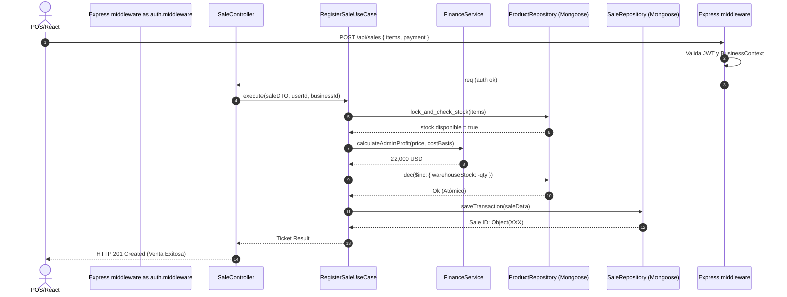
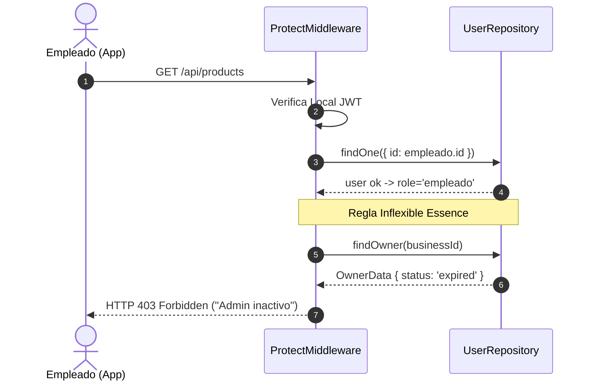

# 🔁 DIAGRAMAS DE SECUENCIA (LIFECYCLE)

> **Propósito:** Esquematizar en formato de secuencia los flujos de arquitectura de red y la interacción entre Backend, Base de Datos y Servicios de Dominio. 

---

## 1. Patrón Hexagonal: Registro de Venta y Deducción Atómica

El siguiente diagrama detalla la ruta de los datos atravesando los *Drivers Adapters* (Controller) hacia los *Use Cases* (Aplicación) y finalmente al repositorio de datos.

---

## 2. Herencia de Acceso (Validación Owner para Employee)

Este diagrama demuestra las reglas de seguridad invisibles operando a nivel de *Middleware*.

