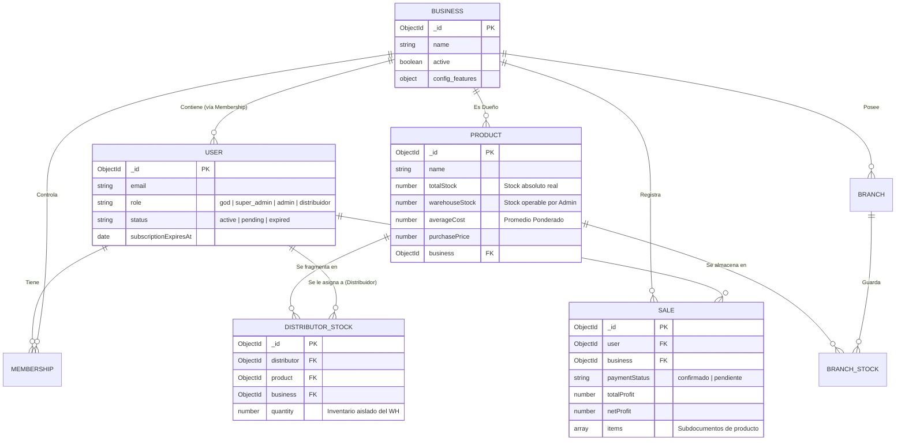

# 🗄️ MODELADO DE DATOS (ERD y Arquitectura MongoDB)

> **Propósito:** Especificar el esquema relacional NoSQL (Mongoose/MongoDB) de la plataforma Essence, detallando las referencias por *ObjectIDs*, los índices de optimización y las fronteras de los documentos.

---

## 1. Diagrama Entidad-Relación (ERD)

Aunque MongoDB es NoSQL, Essence ERP mantiene una integridad referencial estricta manejada a nivel aplicativo mediante Mongoose `ref`.

---

## 2. Decisiones de Diseño NoSQL Críticas

### A. Denormalización vs Referencias
1. **Colecciones Aisladas (Stock):** A diferencia de SQL (una sola tabla gorda con bodegas), en Essence el stock de distribuidores (`DistributorStock`) y de sedes (`BranchStock`) están en colecciones totalmente separadas de la tabla genérica `Products`.
   * *Razón:* Escalar la búsqueda y mutación (`$inc`) de manera aislada sin bloquear el documento *Product* o inflar su Document Size Límite de 16MB.
2. **Histórico Inmutable (Sale.items):** Al momento de registrar una venta (`SALE`), los productos dentro de esa venta se guardan como subdocumentos (arrays empotrados), copiando el `price` local y `costBasis` actual. 
   * *Razón:* Si un producto en el catálogo Master cambia de precio al día siguiente, el recibo de la venta anterior permanecerá inalterado.

### B. Índices de Bases de Datos

Para que el Dashboard resuelva analíticas agregadas (Pipeline de $lookup y $sum) de forma sub-segundo, están declarados los siguientes Compound Indexes:

* `saleSchema.index({ business: 1, saleDate: -1 })` : Lectura secuencial de las últimas ventas de un negocio.
* `saleSchema.index({ business: 1, paymentStatus: 1, saleDate: -1 })` : Recuperación veloz para filtrar únicamente "confirmados" u omitir "créditos pendients".
* `distributorStockSchema.index({ business: 1, distributor: 1, product: 1 }, { unique: true })` : Index único para impedir stocks duplicados entre mismos productos.
